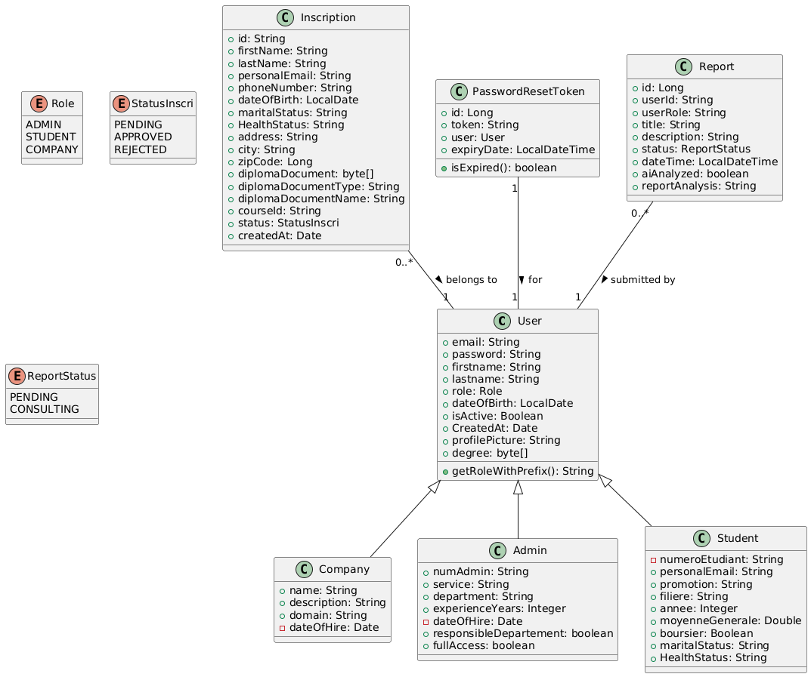
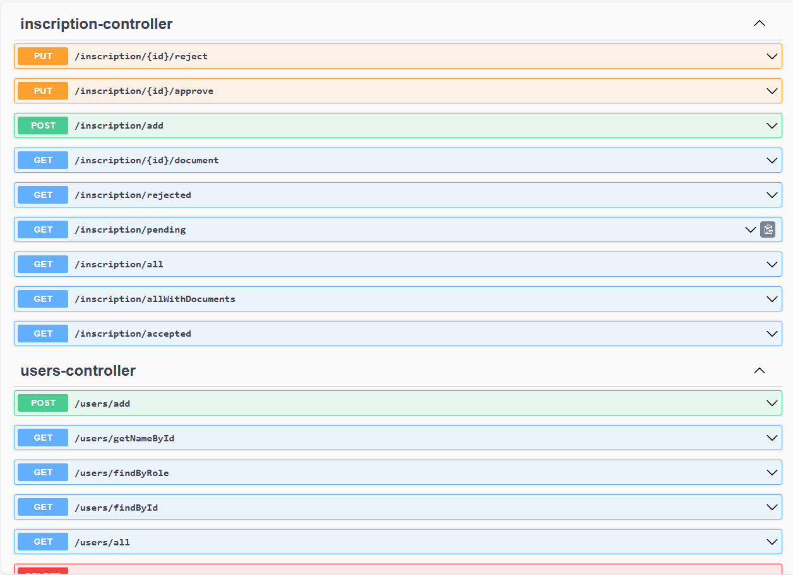

# Users Management Microservice

## Description
This microservice is part of the Coding Factory website, handling all user-related operations and management. It's built using Spring Boot framework and provides RESTful APIs for user authentication, authorization, and profile management.

### Key Features
- User registration and authentication
- Profile management for students and instructors
- Role-based access control (Admin, Student, Instructor)
- User data persistence with Spring Data JPA
- Secure password handling
- Integration with other microservices

## Technology Stack
- Spring Boot
- Spring Security
- Spring Data JPA
- PostgreSQL (hosted on Neon DB)
- Maven
- JWT for authentication

## Database
The application's PostgreSQL database is hosted on Neon DB, providing:
- Serverless deployment
- Automatic scaling
- Built-in backups
- High availability

## Class Diagram


## Screenshots


## Setup and Installation
1. Clone the repository
2. Configure application.properties with your Neon DB credentials
3. Run `mvn clean install`
4. Start the application with `mvn spring-boot:run`

## API Documentation
The API documentation is available at `http://localhost:8080/swagger-ui.html` when running the application locally.

## Dependencies
- Java 17 or higher
- Maven 3.8+
- PostgreSQL 17

## Docker Deployment
The microservice is available as a Docker image on DockerHub. You can pull and run it directly using:

```bash
# Pull the image
docker pull yassine10/users-service:v5

# Run the container
docker run -p 8083:8080 yassine10/users-service:v5
```

### Docker Compose
You can also run this service along with other microservices using Docker Compose. Here's a sample configuration:

```yaml
services:
  users-service:
    image: yassine10/users-service:v5
    container_name: users-service
    ports:
      - "8083:8080"
    networks:
      - app-network

networks:
  app-network:
    driver: bridge
```

The service will be available at `http://localhost:8083` after successful deployment.

Note: Make sure you have Docker and Docker Compose installed on your system before running these commands.